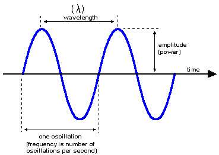
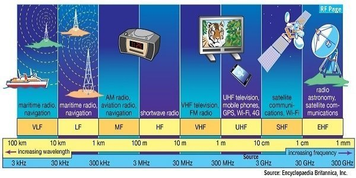

# Radio Frequency (RF) Basics

**Radio Frequency (RF)** refers to the range of electromagnetic waves typically used for wireless communications through broadcast radio, mobile phones, radar systems or satelite links. To understand RF we need to understand the parts that make it up (frequency, wavelength, amplitude and bandwidth).

## Frequency and Wavelength

**Frequency** refers to the number of oscillations (cycles) a wave completes in *one second*, measured in **hertz (Hz)**. For example, a signal with a frequency of 1 MHz oscillates one million times per second while a signal with a frequency of 1 GHz oscillates one billion times a second. 

* 1 KHz = 1,000 Hz
* 1 MHz = 1,000,000 Hz
* 1 GHz = 1,000,000,000 Hz

Closely related is the **wavelength** which is the physical distance between consecutive points of similar phase on a wave — like crest to crest. Wavelength and frequency are inverse related: as frequecy increases, wavelength decreases according to the **wave equation**:

$$
\lambda = \frac{c}{f}\
$$

where:
* $\lambda$ (lambda) represents the wavelength.
* $c$ represents the speed of the wave (e.g., the speed of light for electromagnetic waves, or the speed of sound for sound waves).
* $f$ represents the frequency.

## Amplitude

**Amplitude** describes the strength or *power* of the signal. It is often measured in **decibels (dB)**, a logarithmic unit that expresses the ratio between two power levels. In RF engineering, decibels are widely used to represent signal gains and losses, such as *antenna gain or path loss*. A value in dB doesn't represent an absolute quantity but a relative comparison — for example, a signal that is 10 dB stronger than another is **10 times** more powerful.

## Bandwidth

**Bandwidth** defines the *range of frequencies* that a signal occupies or that a system can process. For example, a communication channel that uses frequencies from 2.40 GHz to 2.48 GHz has a bandwidth of 80 MHz. It is bandwidth that determines **how much** information can be transmitted over a channel: higher bandwidth allows for higher data rates.

# The RF Spectrum

The RF spectrum is divided into standardized **frequency bands**, each suited for specific applications and regulated by national and international bodies such as the **Federal Communications Commission (FCC)** and the **International Telecommunication Union (ITU)**. These bands range from Very Low Frequency (VLF, 3-10 kHz) used in submarine communication, up to Extremely High Frequency (EHF 30-300 GHz), which includes the millimeter wave bands used in modern 5G networks and satellite communications.

| Band | Frequency Range | Common Applications                   |
| ---- | --------------- | ------------------------------------- |
| VLF  | 3–30 kHz        | Submarine communication               |
| LF   | 30–300 kHz      | Navigation systems                    |
| MF   | 300 kHz–3 MHz   | AM radio                              |
| HF   | 3–30 MHz        | Shortwave radio, long-distance comm.  |
| VHF  | 30–300 MHz      | FM radio, television, aviation comm.  |
| UHF  | 300 MHz–3 GHz   | Mobile phones, Wi-Fi, TV broadcasting |
| SHF  | 3–30 GHz        | Satellite comms, radar, microwave     |
| EHF  | 30–300 GHz      | Advanced radar, 5G, deep-space comm.  |

The use of these bands is carefully managed to *prevent interference and ensure efficient utilization* of the spectrum. Some frequencies are reserved for licensed use (satellite uplinks), while others, such as portions of the ISM (Industrial, Scientific and Medical) bands, are unlicensed and available for shared public use, often without power restrictions. In practice, RF systems must be carefully designed to match the indended frequency band and bandwidth to the applications requirements. This includes selecting appropriate antennas, filters, amplifiers and modulation schemes to optimize performance and comply with regulatory limits.