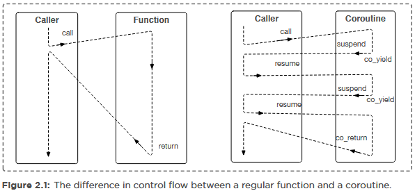

# Using Coroutines in C++ 20

Examples, explanations and diagrams from the textbook *Programming with C++20 by Andreas Fertig*.

## Coroutines

A **coroutine** is a special type of function that can *suspend its execution* and later *resume from the point where it left off*, while preserving its internal state. The term *coroutine* has been around since 1958 but only with C++20 has it become a language feature. Coroutines enable a new way of writing functions that produce sequences of values or handle asynchronous logic, allowing for a cleaner separation between **computation logic** and **data consumption**.

## Regular Functions and Their Limitations

Before we dive into what coroutines offer, lets look at the limitations of traditional functions.

```cpp
for (int i = 0; i < 5; i++) {
    useCounterValue(i);
}
```

This loop mixes two distinct responsibilities: **generating numbers** and **consuming them**. When this pattern is repeated with different boundaries or logic, we duplicate code and introduce opportunities for subtle bugs, like off-by-one errors. Moreover, when we try to generalize this with lambdas or static variables to store a counter to store a counter, the solutions become rigid, difficult to manage and non-thread safe. Regular functions *lack the flexibility to pause and resume* with their linear flow of execution, making them poor candidates for generators or event-driven code.

## Coroutines for a Better Control Flow

Coroutines change this paradigm by introducing **resumable functions**. They allow a function to temporarily **yield control** and **return a value**, then pick up where it left off. This means that generation and usage can be separated cleanly.

In contrast to regular functions which execute linearly from start to finish, a coroutine can stop mid-way using `co-yield`, hand a value back to the caller and be *resumed later* (suspension of execution). These behavioral differences between regular functions and coroutines is shown below in figure 2.1.



### Coroutine Example: Counter Generator

Lets take a look at an example use case for a coroutine; generating a value.

```cpp
IntGenerator counter(int start, int end) {
    while(start < end) {
        co_yield start;
        start++;
    }
}
```

In the code above, `IntGenerator` is the type for the coroutine wrapper (an interface) that allows us to use the coroutine function in a range-based loop. This wrapper contains all the necessary values and methods for the coroutine to perform its task including how it should handle values/exceptions and other internal behavior. `counter` is the coroutine function which can yield a value (with `co_yield`) and suspend its execution. The usage of `co_yield` suspends the coroutine and sends a value back to the caller. Each time the coroutine is resumed, it continues after the last `co_yield`.

```cpp
void UseCounter() {
    auto g = counter(1, 5);
    for (auto i : g) {
        UseCounterValue(i);
    }
}
```

Now everytime `UseCounter` is called, we can pickup from the counter value we left with last time without having to duplicate a for loop or manage global variables.

### Coroutines Maintain State Automatically

Another important advantage of coroutines is **automatic state preservation**. In the regular counter implementation using a static variable, the function could only track one counter state globally. With coroutines, each call to the generator creates an **independant state machine**. You can spawn multiple generator instances, each with their own internal state, without writing any extra logic for managing those states. This is the foundation that makes coroutines powerful for **asyncronous programming, generators** and **iuterative processing**.

Coroutines are stackless which means they do not maintain their own stack. Instead, when a coroutine suspends, it returns control to the caller, and the necessary state for resumption is stored separately, typically on the heap in a **coroutine frame**. This approach differs from stackful coroutines (like Golang's goroutines) which allocate a separate stack for each coroutine, similar to threads.

### Coroutine Keywords

Coroutines in C++ are maked using one of the following three keywords:

| Keyword     | Purpose                  | Behavior   |
| ----------- | ------------------------ | ---------- |
| `co_yield`  | Yields a value           | Suspends   |
| `co_return` | Ends the coroutine       | Terminates |
| `co_await`  | Waits on an async result | Suspends   |

If any of these appear in a function, the function becomes a coroutine. The compiler will transform it into a **finate state machine (FSM)** with the coroutine's state held in the *coroutine frame*.