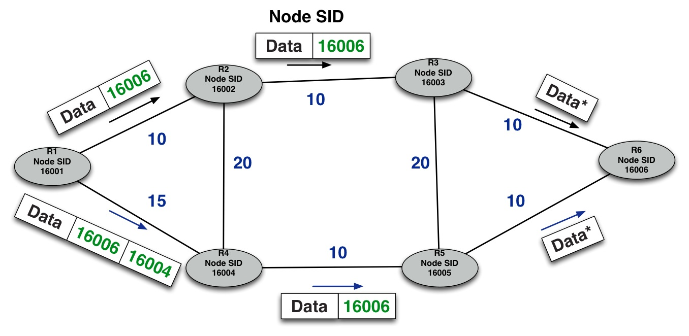
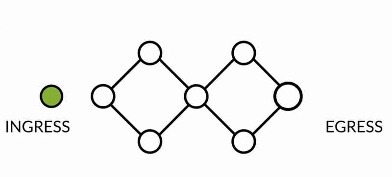

# Segment Routing (SR)

Segment Routing (SR) is a technique where packets are forwarded through a network based on the **source routing** paradigm. Unlike traditional routing methods that rely on distributed, hop-by-hop path decisions, SR defines the complete path a packet should take *before it ever leaves the source*. This **path** is encoded directly into the packet header as an ordered list of **segments**, each of which contains forwarding instructions. These instructions are interpreted by the routers along the path.

Each router in the network examines the topmost segment from the packet'segment list. If the segment **identifies a remote node**, the router uses Equal-Cost Multi-Path (ECMP) mechanisms to forward the packet toward the next hop. **If the segment identifies the current router**, the segment is popped from the list and the router executes the instructions associated with the next segment. This design shifts path computation and state management to the network edge, dramatically simplifying the core of the network.

Segment Routing can operate over existing **Interior Gateway Protocols (IGPs)** such as **IS-IS** and **OSPF**, and it utilizes **MPLS** in the data plate to forward traffic. By combining these technologies, Segment Routing offers a highly efficient and scalable alternative to legacy traffic engineering protocols. Its reliance on source routing and elimination of signaling protocols like **Label Distribution Protocol (LDP)** and **Resource Reservation Protocol - Traffic Engineering (RSVP-TE)** reduces both operational complexity and convergence time in MPLS core networks.

## How Does Segment Routing Work?

In a Segment Routing network, routers are capable of choosing between two primary forwarding strategies:

* Explicit, pre-defined path.
* Shortest path determined by the IGP.

These paths are constructed using smaller building blocks known as segments, which are sub-paths to a destination. Segments are identified by unique values known as **Segment Identifiers (SIDs)**, which are spread through the network using new extensions to traditional IGPs. These extensions are compatible with both IPv4 and IPv6 control planes.

A key difference from conventional MPLS deployments is that Segment Routing *does not* depend on LDP or RSVP-TE to allocate or signal labels. Instead, segment identifiers are programmed directly into the routers forwarding tables via IGP mechanisms. Each router (node) and link (node adjacency) has an associated SID. A **Node SID** is globally unique and identifies the shortest path to a particular router,a s calculated by the IGP. Network admins assign node SIDs from a reserved label block known as the **SR Global Block (SRGB)**. In contrast, an **Adjacency SID** represents a specific interface or link to a neighboring router and is only locally significant to the advertising router. These adjacency SIDs are automatically generated and do not come from the global pool.

In *MPLS-based Segment Routing networks*, segment identifiers are encoded as MPLS labels. When a packet travels across the network, these labels guide its path. If a Node SID is used, the label remains on the packet until it reaches its destination, with each hop performing a label swap as per standard MPLS behavior. However, when an adjacency SID is on top of the stack, the label is removed (popped) by the router that owns the adjacency, and the packet is forwarded through the specified link.

> Credit: *Juniper Networks - Segment Routing Fundamentals*